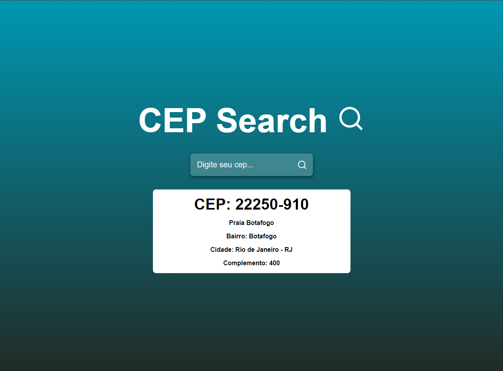

# CEP Search

Este é um aplicativo simples, feito em REACT + VITE que permite ao usuário buscar informações de endereço utilizando o CEP. Ao digitar um CEP válido no campo de busca e clicar no botão "Buscar" ou pressionar a tecla Enter, o aplicativo faz uma requisição à API do ViaCEP e exibe as informações encontradas, como logradouro, bairro, cidade e estado.

 
